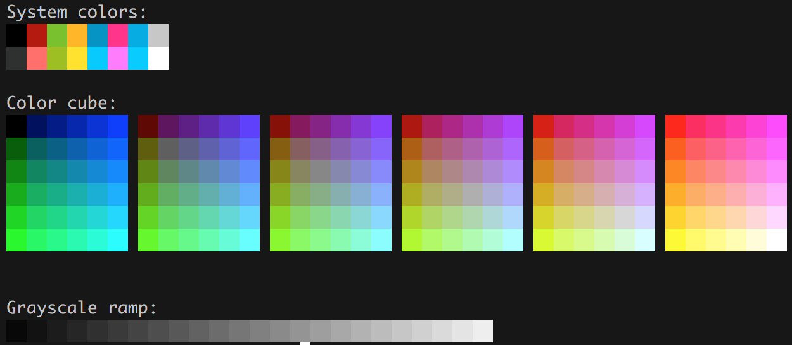
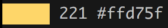

# Hextermbiest

> A Hexenbiest is a witch-like Wesen that resembles a corpse, with visibly
> decaying flesh.
— http://grimm.wikia.com/wiki/Hexenbiest_%26_Zauberbiest

A color playground. It started as a need to translate colors in hexadecimal
to XTerm 256 for my Vim colorschemes.


## Usage

To use the cube use the standalone cli:

```sh
cargo run --bin cube
```




To use the codex use the standalone cli:

```sh
cargo run --bin codex | grep 221
```




## TODO

* Unify CLI under `biest`.
* Implement `biest --from hex <hex>`.


## License

[MIT License](https://github.com/arnau/hextermbiest/blob/master/LICENSE).
